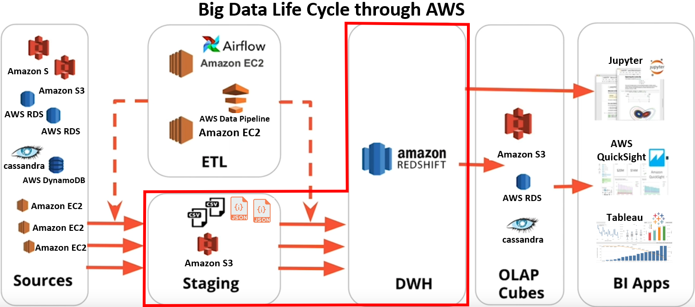
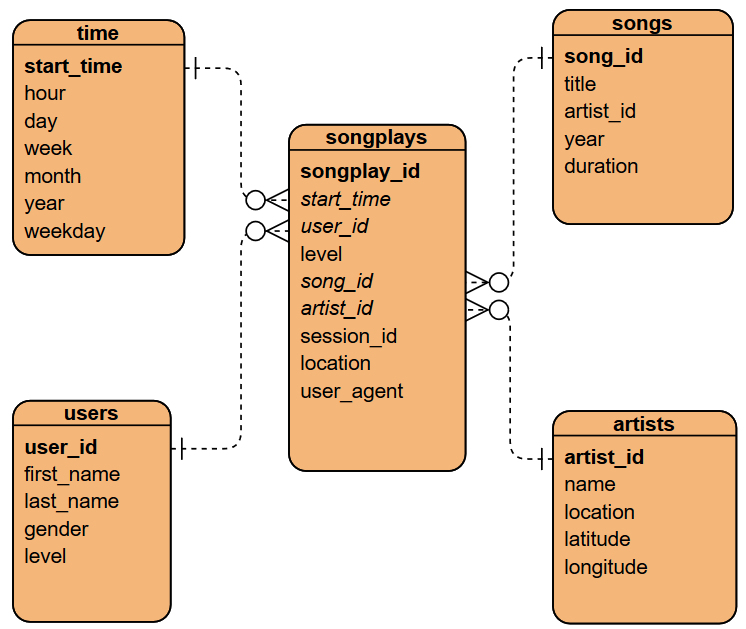
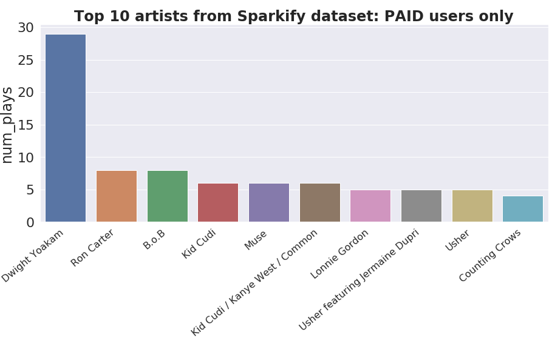

# AWS Data Warehouse
### Project from Udacity Data Engineering nanodegree
This project places myself as a Data Engineer for a fictional music streaming company called Sparkify. They have an expanded user and song database and want to move it onto the cloud. Their data resides on S3 (AWS storage service) as raw JSON files.

### Objective
Build an ETL pipeline to extract the data from S3 into staging tables in Redshift, and transform the data into analytics tables following a typical STAR schema. The image below shows where this workflow is placed relative to the "Big Data Life Cycle" in AWS (image modified from Udacity course notes).
 

### Song JSON data
The first dataset is a subset of real data from the [Million Song Dataset](http://millionsongdataset.com/).  
Each JSON file has metadata for a particular track, with the following fields:
- num_songs, artist_id, artist_latitude, artist_longitude, artist_location, artist_name, song_id, title, duration, year

### Log JSON data  
The second dataset is user songplay log files in JSON format generated by this [event simulator](https://github.com/Interana/eventsim). These simulate activity logs from a music streaming app based on specified configurations.  
Below is an example of what the data in 2018-11-12-events.json looks like:  
  

### Redshift database schema
The image below shows the relational properties of the final analytic tables. It is a typical STAR schema, with the fact table (songplays) and 4 dimension tables. It is optimized for analytic queries to answer any questions on user songplay behavior!


### Instructions
1. Open **config_info.txt** and populate the parameters with your own AWS settings. Save as **dwh.cfg**  
2. Look through **sql_queries.py** to understand what SQL queries are used throughout the Python scripts.  
3. Run **create_cluster.py** in terminal to create a Redshift cluster based on the **dwh.cfg** values
4. Run **cluster_status.py** in terminal to see the cluster status, wait until status is "available" 
5. Run **create_tables.py** in terminal to refresh and create the tables in Redshift
6. Run **etl.py** to load the data from S3 to Redshift, and populate the analytics tables
7. Walk through **notebooks/analytic_bashboard.ipynb** to see some basic queries and findings of user preferences based on the data
8. (Optional) Run **connect_terminal.py** to connect directly to the Redshift DB, and explore the tables using psql commands!

### Extra work completed   
- Included a function in **etl.py** to remove any duplicate rows from the tables (which can sometimes happen in Redshift since Primary Keys are not enforced)
- Included the **notebooks/analytic_bashboard.ipynb** notebook with some visualizations of some basic queries. See sample query and resulting image below.

### Sample SQL query for the top 10 artists of the Sparkify dataset
```
SELECT a.name AS artist_name, COUNT(*) AS num_plays 
FROM songplays s 
JOIN artists a
ON s.artist_id = a.artist_id
GROUP BY a.name 
ORDER BY num_plays DESC 
LIMIT 10;
```
  

### Suggestions for Udacity to improve project
- Include some other fields such as song genre, and beats-per-minute, so we can do more in depth analysis of what user preferences are.